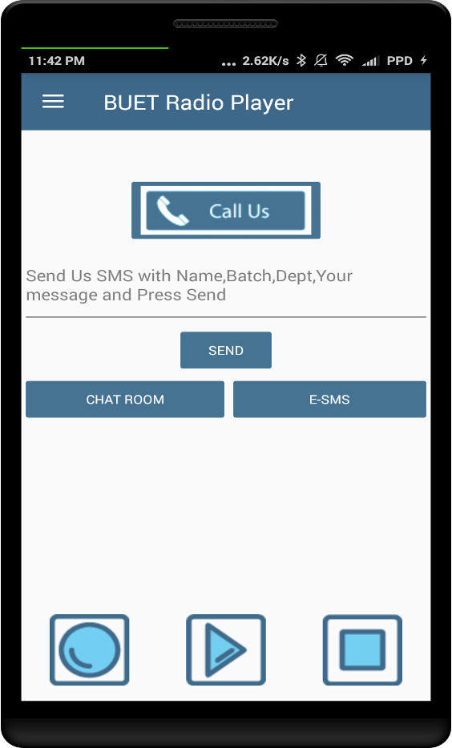
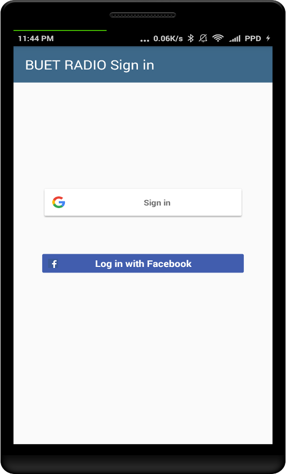
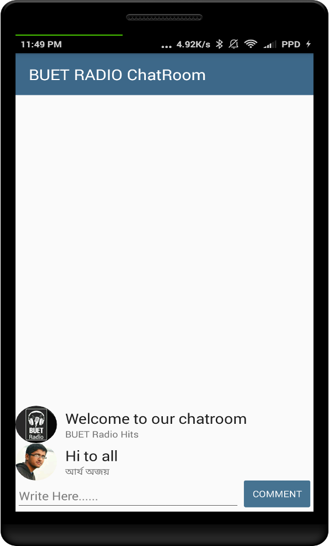
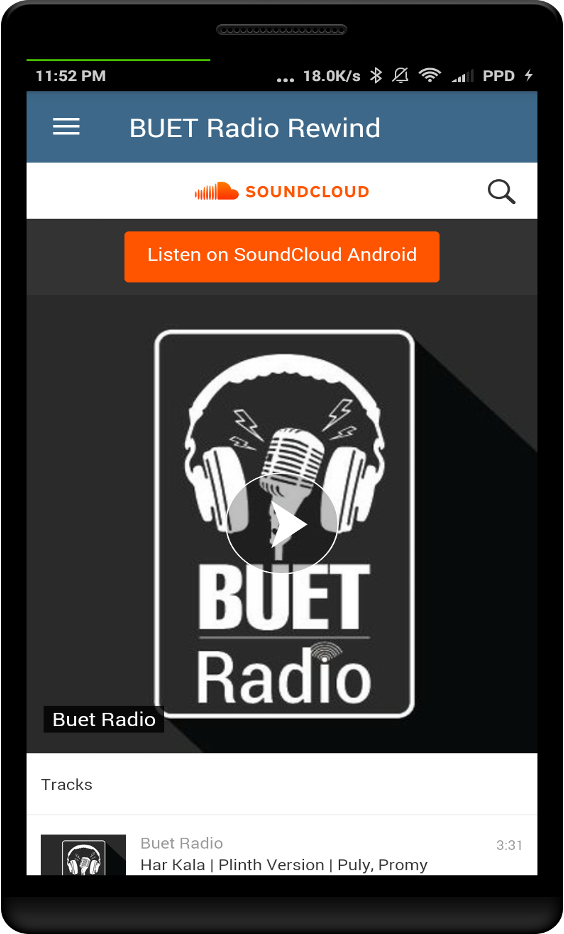
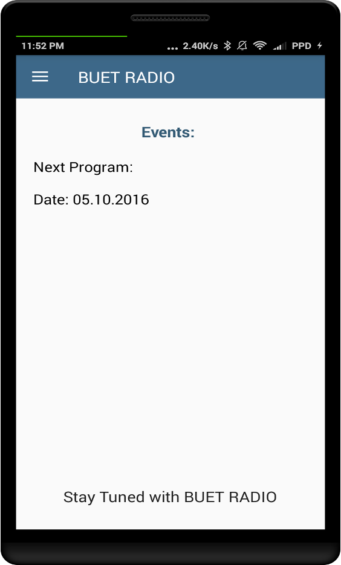
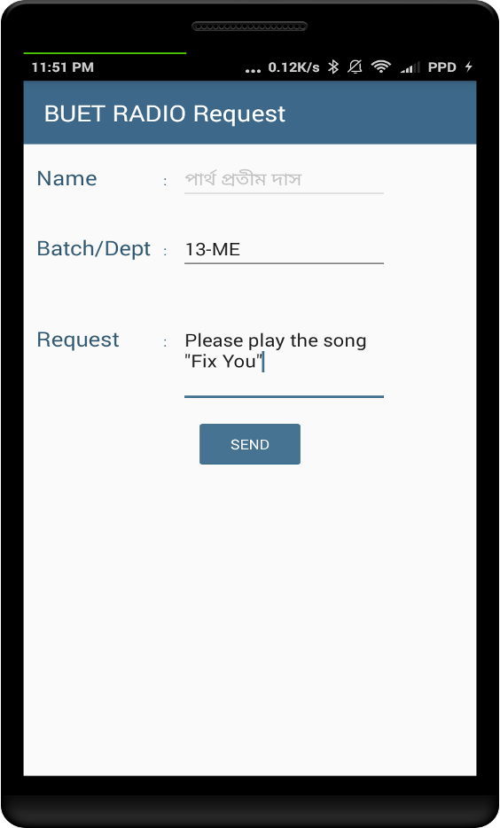

# BUET Radio App
An Android app for streaming university campus radio.

### Features
- Streaming: Stream campus radio directly through the App.
- Request submission: Submit you requests through the app directly.
- Notification: Learn about the events through notifications.

Admin features:
- Remote Configuration: Change stream servers and contacts remotely without requiring the clients to update.
- Crash Reporting: Learn about the bugs and crashes from firebase consol.

### Tech Stack
- Android Native
- Firebase Database
- Firebase Signin
- Radio Streamer

### UI Screenshots

- **Main UI:**    

&nbsp;

- **Sign In UI:**    

&nbsp;

- **Radio Chatroom UI:**    

&nbsp;

- **Radio Session Archive UI:**    

&nbsp;

- **Events Notice UI:**    

&nbsp;

- **Requests Submission UI:**    

&nbsp;

